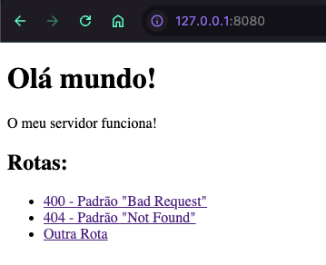

# Redes - HTTP Server

Introdução ao desenvolvimento de uma abstração de servidor HTTP utilizando sockets, sem o uso de bibliotecas de terceiros para a implementação do protocolo HTTP.



Componentes:

- Ernane Ferreira (@ernanej)
- Quelita Míriam (@quelita2)

## Exemplo de solicitações

Abaixo estão os comandos `telnet` para cada uma das rotas mencionadas. Vamos simular as requisições HTTP para o seu servidor nas diferentes rotas e tipos de arquivos:

```bash
telnet 127.0.0.1 8080
GET /400/index.html HTTP/1.1 # acessando direto o conteúdo da 400, retorno 200
Host: 127.0.0.1:8080
```

```bash
telnet 127.0.0.1 8080
GET /404/index.html HTTP/1.1 # acessando direto o conteúdo da 404, retorno 200
Host: 127.0.0.1:8080
```

```bash
telnet 127.0.0.1 8080
GET /assets/teste.css HTTP/1.1 # retorno 200
Host: 127.0.0.1:8080
```

```bash
telnet 127.0.0.1 8080
GET /assets/teste.jpg HTTP/1.1 # retorno 400
Host: 127.0.0.1:8080
```

```bash
telnet 127.0.0.1 8080
GET /assets/teste.js HTTP/1.1 # retorno 200
Host: 127.0.0.1:8080
```

```bash
telnet 127.0.0.1 8080
GET /assets/teste.json HTTP/1.1 # retorno 200
Host: 127.0.0.1:8080
```

```bash
telnet 127.0.0.1 8080
GET / HTTP/1.1 # ou /index.html, retorno 200
Host: 127.0.0.1:8080
```

```bash
telnet 127.0.0.1 8080
POST / HTTP/1.1 # retorno 400, bad request
Host: 127.0.0.1:8080
```

```bash
telnet 127.0.0.1 8080
GET /outra-rota/index.html HTTP/1.1 # ou somente /outra-rota/ ou /outra-rota, retorno 200
Host: 127.0.0.1:8080
```

```bash
telnet 127.0.0.1 8080
GET /asdasfadsa HTTP/1.1 # retorno 404, rota inexistente
Host: 127.0.0.1:8080
```

Toda as solicitações também podem ser realizadas diretamente pelo navegador e seu retorno será renderizado corretamente.

## Estrutura de arquivos/rotas no servidor

```bash
├── 400
│   └── index.html
├── 404
│   └── index.html
├── assets
│   ├── teste.css
│   ├── teste.jpg
│   ├── teste.js
│   └── teste.json
├── index.html
└── outra-rota
    └── index.html
```

### Observações

Ao acessar alguma rota ou arquivo que não existe o retorno será 404. Ao acessar algo que cause quebra e/ou algum arquivo não previsto nos tipos, mesmo que disponível no servidor, retornará 400. Qualquer outra solicitação e suas variações (/rota, /rota/, /rota/index.html, etc) será suportada e renderizada/retornada.

No navegador todas as rotas previstas devem funcionar exceto a `/assets/teste.jpg` que é um teste para verificar se a solicitação receberá retorno 400 devido o formato do arquivo.

### Exemplo de saída

[Logs](./src/backend/output.logs).

## Venv

```bash
# Python 3.12.8 (with asdf)
python -m venv venv
source venv/bin/activate
```
